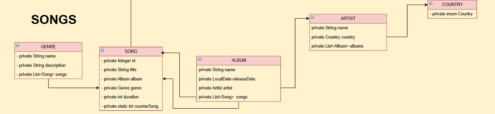

# Music Recommender System

## Introduction
The application will manage a detailed data model with users, songs, artists, genres, and listening sessions. 
Additionally, data science techniques will be applied to analyze patterns in user preferences and audio data, offering a robust recommendation engine.

### Features

### 1. Authentication

#### Auth

| Feature           | Description                      | Status | Developer |
|-------------------|----------------------------------|--------|-----------|
| Register          | Method void register (User user) | Done   | Steven    |
| Login             | Method User login                | Done   | Steven    |
| Generate Nickname | Generate random nickname         | Done   | Steven    |

#### User

| Feature       | Description                                              | Status | Developer |
|---------------|----------------------------------------------------------|--------|-----------|
| Guest_User    | Guest user access to Manager System                      | Done   | Steven    |  
| Admin_User    | Admin user access to Administrator Manager System        | Done   | Steven    |
| Member_User   | Access to Manager System, but will have not manipulating | Done   | Steven    |

### 2. Manager

#### AdminManager

| Feature       | Description    | Status | Developer |
|---------------|----------------|--------|-----------|
| Add Song      | Add new Songs  | Done   | Julia     |
| Update Song   | Add new Artist | Done   | Julia     |
| Remove Song   | Add new Genre  | Done   | Julia     |
| Show All Song | Add new Genre  | Done   | Julia     |

#### MusicManager

| Feature                | Description                                | Status | Developer |
|------------------------|--------------------------------------------|--|-----------|
| Access Admin Interface | Access member user to yourself profile     | Done | Steven    |
| Validate Song          | Validate song                              | Done | Melina    |
| Play Song              | Play song                                  | Done | Melina    |
| Pause Song             | Pause song                                 | Done | Melina    |
| Resume Song            | Resume song                                | Done | Melina    |
| Next Song              | Next song                                  | Done | Melina    |
| Previous Song          | Previous song                              | Done | Melina    |
| Search Song by Title   | Search by Title and return a Song          | Done | Melina    |
| Shows Songs By Genre   | Search by Genre and return a list of songs | Done | Melina    |
| Search By Artist       | Search by Artist and return a Songs        | Done | Melina    |
| Search By Release      | Search by range date and return Albums     | Done | Melina    |
| Real Time Search       | Search by different parameters             | Done | Steven    |

#### UserHistory

| Feature               | Description                                                                 | Status | Developer |
|-----------------------|-----------------------------------------------------------------------------|--|--------|
| Show Profile          | Show your Profile                                                           | Done | Theo   |
| Counter Song   |Increases the Song play value by +1 each time the user listens to a song   | Done | Theo   |
| Counter Album   |Increases the Album play value by +1 each time the user listens to a song   | Done | Theo   |
| Counter Artist   |Increases the Artist play value by +1 each time the user listens to a song   | Done | Theo   |
| Counter Genre   |Increases the Genre play value by +1 each time the user listens to a song   | Done | Theo   |
| Show Favorite Songs   | Provides a list of all your listened songs ordered by the amount of plays   | Done | Theo   |
| Show Favorite Albums  | Provides a list of all your listened albums ordered by the amount of plays  | Done | Theo   |
| Show Favorite Artists | Provides a list of all your listened artists ordered by the amount of plays | Done | Theo   |
| Show Favorite Genres  | Provides a list of all your listened genres ordered by the amount of plays  | Done | Theo   | 

### 3. Songs

#### Song

| Feature           | Description                         | Status | Developer     |
|-------------------|-------------------------------------|--------|---------------|
| Song Class        | To Make Class Song with composition | Done   | Steven & Theo |

### 4. DATA

#### Data

| Feature    | Description                 | Status | Developer      |
|------------|-----------------------------|--------|----------------| 
| Data Class | generate instance DataSongs | Done   | Steven & Julia | 

### Documentation
+ [Class Diagram Project Music Recommender System](https://drive.google.com/file/d/1EfPopsuNGfS590GFdUUheVOVDKjg46cd/view?usp=drive_link)
+ [Scrum Planner](https://docs.google.com/spreadsheets/d/1rEBiQTtqf0slariM-Mr7hmkwMj8jV7SxucW3dnAYtes/edit?usp=sharing)
+ [Scrum Report](https://docs.google.com/document/d/1i74uvANGPbzYQX3pflOqah5UxF3w0kFpW3wvfyKNrE0/edit?usp=sharing)
